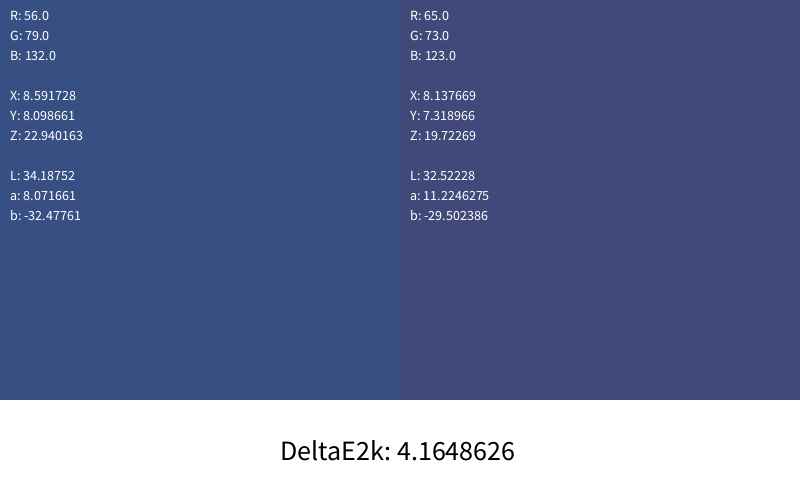

# RGBToDeltaE
A java Processing implementation of CIELab DeltaE 2000

Caveat Emptor:  My values differ from an online reference implementation.  I suspect this to be a floating point error or a different weighting of the delta e function.  If this is for anything more than your amusement, I would refer instead to a different source.
